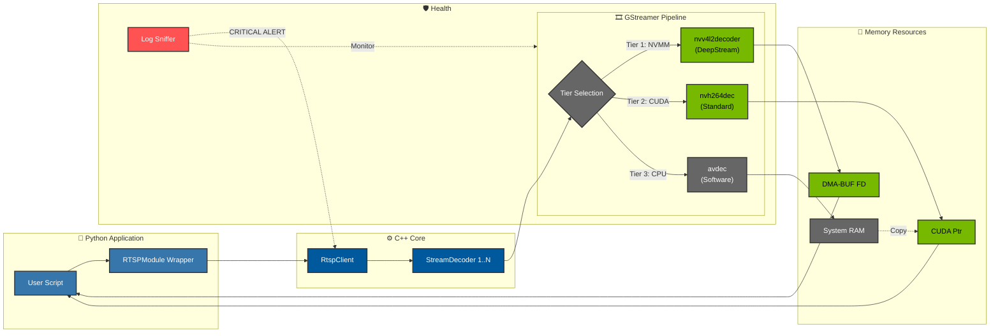
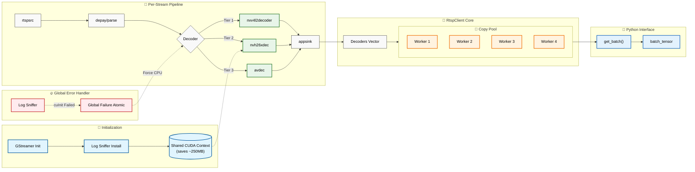

# RTSPModule Architecture Document

## 1. Overview
This module provides a lightweight, high-performance **RTSP H.264/H.265 decoder** with **CUDA zero-copy** frame delivery for Python applications. It is built on GStreamer with NVIDIA hardware acceleration.

## 2. High-Level Architecture



## 3. Low-Level Architecture (N Streams)



## 4. Component Details

### 4.1 RtspClient
-   **Orchestrator:** Manages lifecycle of all `StreamDecoder` instances.
-   **Threads:**
    -   **Main Thread:** Python GIL interactions and control logic.
    -   **Reconnection Thread:** Background monitoring of stream health.
    -   **Copy Pool (New):** A dedicated thread pool (4 workers) for parallelizing memory copies during `get_batch()`, significantly reducing latency for large batches.
-   **Context:** Pre-allocates a shared GStreamer CUDA context to save VRAM.

### 4.2 StreamDecoder
-   **Pipeline Manager:** Encapsulates the GStreamer pipeline for a single stream.
-   **Decoder Strategy (3-Tier Fallback):**
    1.  **DeepStream (`nvv4l2decoder`):** Preferred if NVIDIA drivers and DeepStream are present. Uses `NVMM` memory.
    2.  **Standard CUDA (`nvh264dec`):** Fallback if DeepStream is missing. Uses `CUDAMemory`.
    3.  **CPU (`avdec`):** Final fallback if GPU is unavailable or fails.
-   **Watchdog:** Monitors frame arrival; triggers reconnect if stream stalls.

### 4.3 Memory Path & DeepStream Integration
-   **NVMM Path:** When using DeepStream, frames are accessed via **DMA-BUF** file descriptors mapped to `NvBufSurface`.
-   **CUDA Path:** Standard GStreamer memory is mapped directly to CUDA device pointers.
-   **CpuBuffer (Ring Buffer):**
    -   Fixed-size wait-free ring buffer for temporal history.
    -   **Dynamic Resizing:** Automatically resizes based on detected stream FPS.
    -   **Fallback:** Automatically activates if GPU acceleration fails globally or per-stream.

### 4.4 Global Error Handling ("Log Sniffer")
-   A custom GStreamer log handler intercepts low-level error messages.
-   **Critical Detection:** Scans for patterns like `cuInit failed` or `Resource error`.
-   **Global Fallback:** If a critical GPU error is detected, the `global_gpu_failure_` atomic flag is set, forcing all current and future streams to switch to CPU mode immediately to prevent crash loops.

## 5. Memory Footprint

| Component | Memory |
| :--- | :--- |
| CUDA Context Initialization | ~250 MB |
| Per 1080p Stream (NVDEC + Buffers) | ~30-35 MB |

**Example:** 9 streams → `250 + (9 × 32.5) ≈ 542 MB` GPU memory.

## 6. Data Flow

1. **Startup:** Initialize GStreamer and pre-allocate shared CUDA context
2. **Stream Start:** Each decoder creates a GStreamer pipeline with shared context
3. **Frame Arrival:** Callback maps CUDA memory and stores device pointer
4. **Python Access:** Returns pointer; CuPy wraps it as a zero-copy GPU array

---

## 7. Why This Architecture is Good

### 7.1 Zero-Copy GPU Pipeline
Frames decoded by NVDEC remain in GPU memory throughout the entire pipeline. No CPU-GPU transfers occur in the optimal path, resulting in:
- **Lower latency** (frames available immediately after decode)
- **Higher throughput** (no PCIe bottleneck)
- **Reduced CPU usage** (no memcpy operations)

### 7.2 Shared CUDA Context
A single CUDA context is created once at startup and shared across all streams:
- **Saves ~200-250 MB** per additional stream (vs. per-stream context)
- **Faster stream initialization** (no repeated context creation)
- **Lower VRAM fragmentation**

### 7.3 Lightweight Dependency
Unlike heavyweight SDKs, this architecture uses only:
- GStreamer core with nvcodec plugin (~200 MB)
- pybind11 for Python bindings


### 7.4 Framework Agnostic
Decoded frames are standard CuPy GPU arrays compatible with:
- PyTorch (via `torch.as_tensor()`)
- TensorRT (via pointer)
- ONNX Runtime CUDA
- OpenCV GPU
- Any CUDA-based framework

### 7.5 Low Memory Footprint
- **~30-35 MB per 1080p stream** (minimal buffer allocation)
- Efficient use of NVDEC hardware (native NV12 format)
- No duplicate buffers for metadata or preprocessing

### 7.6 Automatic Recovery & Log Sniffing
A dedicated "Log Sniffer" intercepts GStreamer debug logs to detect catastrophic failures (e.g., GPU driver crash) that standard error callbacks miss. This triggers a **Global Fallback** mode, ensuring the application continues running in CPU mode rather than crashing.

### 7.7 Simple Python API
```python
provider.start("config.yaml")
frame = provider.get_cuda_frame(camera_id)
# frame["ptr"] is a GPU device pointer ready for inference
```

## 8. Advanced Features

### 8.1 Batch Retrieval Optimization
The `get_batch()` API uses a **Copy Pool** (default 4 threads) to perform parallel memory operations (e.g., combining frames into a batch tensor). This ensures that fetching 16 streams takes only marginally longer than fetching one.

### 8.2 Dynamic CPU Buffer
The CPU ring buffer is not just a static store; it adapts to the stream:
-   **Auto-Resize:** Adjusts capacity based on real-time FPS detection to maintain exactly $T$ seconds of history.
-   **Lazy Allocation:** Allocates memory only when frames actually arrive.

## 9. Future Improvements (Optional)
-   Zero-copy batching via CUDA Kernels (merging frames on GPU without CPU loop).

