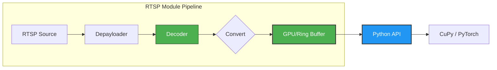

# RTSPModule


**State-of-the-art RTSP stream processing module for Python.**

Designed for **high-throughput video analytics**, RTSPModule leverages the **NVIDIA DeepStream SDK** and **GStreamer** to deliver a high-performance pipeline that enables real-time inference across dozens of simultaneous streams.


[Getting Started](docs/README.md) • [Architecture](docs/architecture.md) • [Docker](docs/docker.md) • [API Reference](docs/api_reference.md) • [Examples](examples/)

---

## 🚀 Key Features

| Feature | Description |
|:---|:---|

| Feature | Description |
|:---|:---|
| **⚡ Zero-Copy GPU** | **DMA-BUF** (DeepStream) and **CUDA** (Standard) paths keep frames in VRAM for direct `torch`/`cupy` access. |
| **🛡️ 3-Tier Fallback** | Auto-selects **DeepStream (NVMM)** → **Standard CUDA** → **CPU** based on available hardware/drivers. |
| **🏎️ Copy Pool** | Multi-threaded parallel memory pool for `get_batch()`, reducing latency for large batch sizes (e.g., 16+ streams). |
| **🧠 Log Sniffer** | Intercepts low-level GStreamer errors (e.g., `cuInit failed`) to trigger **Global Fallback** to CPU mode, preventing crashes. |
| **🔄 CPU Ring Buffer** | **Wait-free** ring buffer with **Auto-Resize** capabilities maintains temporal history and ensures high availability. |
| **🧵 True Concurrency** | GIL-released C++ threads + **Shared CUDA Context** (~250MB/stream saved) ensures zero-blocking high scalability. |

---

## 🏗 Architecture

The pipeline avoids CPU-GPU copying by keeping frames in device memory. Usage of a shared CUDA context across streams saves ~200MB VRAM per stream.



---

## 🛠 Installation

### Option A: From Source (Recommended)

Requires CMake 3.18+, GStreamer 1.20+, and CUDA Toolkit.

```bash
mkdir build && cd build
cmake .. -DCMAKE_BUILD_TYPE=Release
cmake --build . --target _core -j$(nproc)
pip install .
```

### Option B: Docker

Get started instantly with the provided Docker image.

```bash
# Build using the standard Dockerfile
docker build -f docker/Dockerfile -t rtspmodule:latest .

# Run with GPU support
docker run --gpus all -it rtspmodule:latest /bin/bash
```

### Usage Scripts

#### 1. Stability Benchmark (`client.py`)

Runs the pipeline without visualization to test memory stability and calculate raw FPS throughput.

```bash
python3 tools/minimal_client/client.py
```

#### 2. Stream Recording (`recorder.py`)

Records all streams to an MP4 file. (Note: Implementation pending in `tools/minimal_client`)

#### 3. Frame Sync Test (`frame_sync.py`)

Tests the frame synchronization mechanism across multiple streams.

```bash
python3 tools/minimal_client/frame_sync.py
```

See [docs/docker.md](docs/docker.md) for advanced configuration.

---

## ⚡ Quick Start

```python
import rtspmodule
import time

# Initialize with config
provider = rtspmodule.RTSPModule()
provider.start("config.yaml")

# Wait for connections
time.sleep(2)

# Retrieve batch for inference (Zero-copy GPU pointers)
# Returns: { camera_id: { 'ptr': int, 'shape': tuple, ... } }
batch = provider.get_batch(
    stream_ids=[0, 1, 2],
    timeout_ms=33
)

for cam_id, meta in batch.items():
    if meta['valid']:
        print(f"Cam {cam_id}: Received frame {meta['frame_id']} on GPU")

provider.stop()
```


---

## 📂 Project Layout

```text
RTSPModule/
├── src/                    # C++ source files
│   ├── bindings/           # Python bindings (pybind11)
│   ├── core/               # Core C++ implementation
│   └── rtspmodule/         # Compiled module output
├── examples/               # Example Python scripts / C++
├── docs/                   # Detailed documentation
├── include/                # C++ headers
├── tests/                  # Integration and Unit tests
├── configs/                # Configuration files
├── docker/                 # Docker build files
└── CMakeLists.txt          # Build configuration
```


